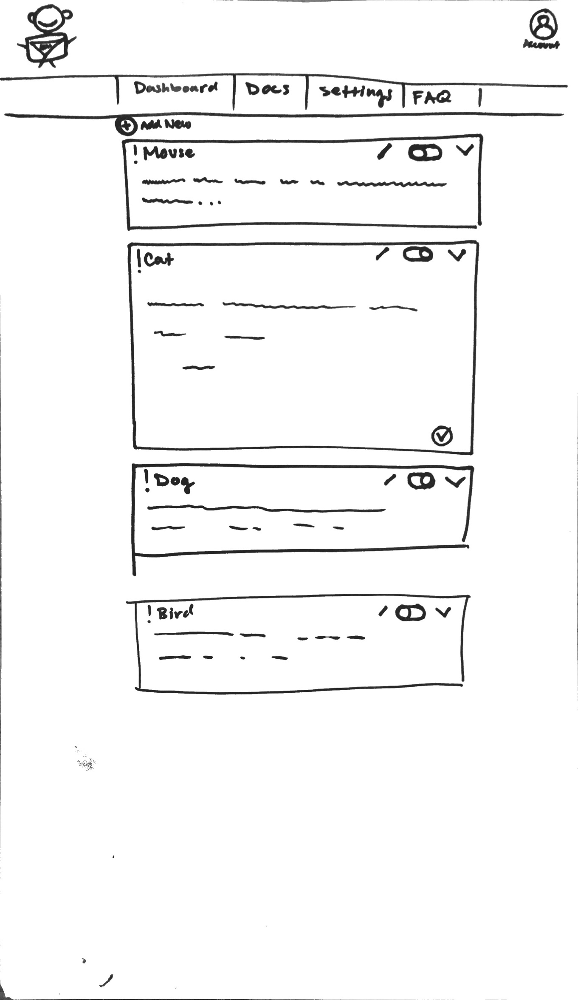
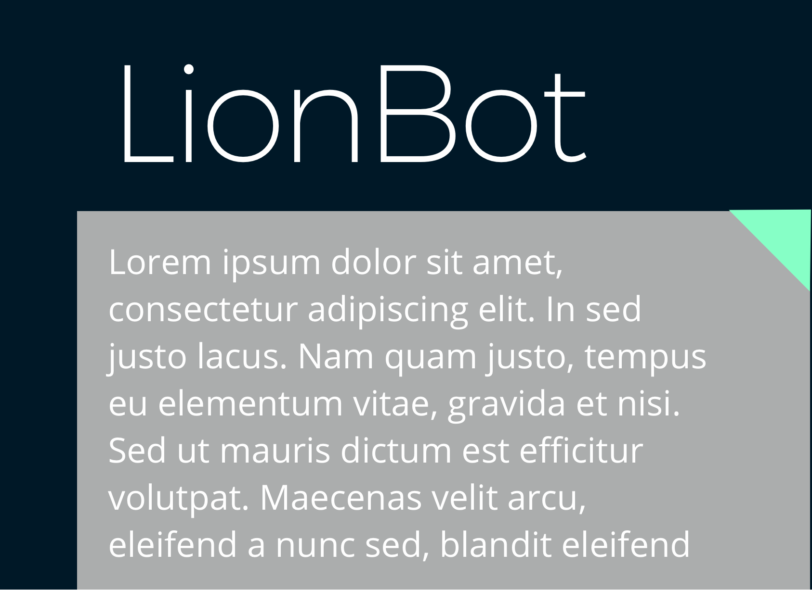

# LionBot
[](https://github.com/k1bs/lionbot/blob/master/LICENSE)
[](https://standardjs.com)



## What is LionBot?

```javascript
const TwitchBot = require('twitch-bot')

const LionBot = new TwitchBot({
  username: 'Kappa_Bot'
  oauth: 'oauth:dwiaj91j1KKona9j9d1420',
  channel: 'twitch'
})
```

[Twitch](https://www.twitch.tv) is one of the fastest growing social media platforms on the web. Focused around video games, users of the site stream gameplay of their favorite games, all while being watched by potentially thousands of people. The key to Twitch is its interactivity, with each streamer having their own chat channel, where viewers can ask questions of the streamer.

Once a stream grows to a certain size, a streamer might be asked by different users in their chat the same question multiple times. Automating some of this interactivity becomes necessary.

That's where LionBot comes in. Through a React dashboard, a streamer can customize automated responses based on the most common questions they can receive. This allows the streamer to focus primarily on unique, more meaningful questions to answer, while the need to answer more mundane questions is alleviated.

## Initial Thoughts on Structure



LionBot, at its core, is made up of two distinct components: the bot itself, which lives in a given Twitch channel's chatroom, and the dashboard, which pairs a React front-end with an Express back-end to provide CRUD functionality.

We will be attempting to use a new NPM module called [Twitch-Bot](https://www.npmjs.com/package/twitch-bot), which uses EventEmitters to listen to commands in Twitch's IRC based chatrooms.

We will also be using React to make API calls to our own custom Express back-end server, managing authentication and commands.

In addition, we look forward to the challenge of writing our own tests for our Express backend.

#### See [Project Board](https://github.com/k1bs/lionbot/projects/1) for Phases of Completion

## User Stories

The primary user of the site is a streamer on Twitch, who needs assistance moderating their chatroom.

When the user visits the page, they are greeted with a Splash page, detailing some of the features of the Bot.

#### When a user clicks Register
- They are taken to a registration screen
- They input their credentials
- They are taken to their dashboard

#### When a user clicks on the dashboard
- They see a list of all their account's commands
- When a command's edit button is clicked
- The user sees a form to edit their command, and its response, also with a delete button
- The user fills out the edit form and hits submit
- The user sees their new command list, with the updated command

#### When a user wants to add a new command
- They click the + button
- A form is displayed, with inputs for the command keyword and the response
- The user clicks submit
- The user sees their new command list

## Links and Resources

(The NPM module that we plan to use.)[https://www.npmjs.com/package/twitch-bot]

## Technologies Used

[](https://github.com/standard/standard)
