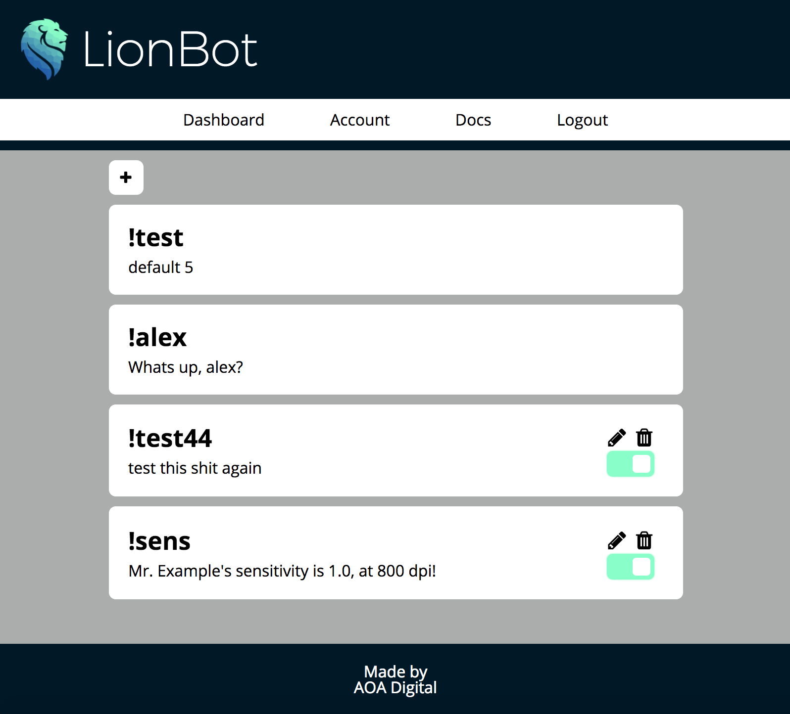
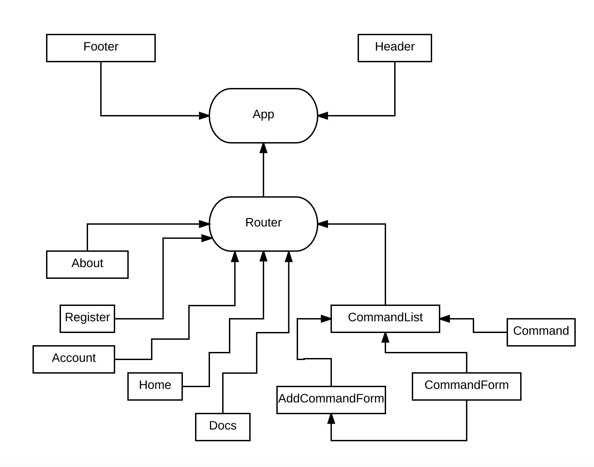

## LionBot - a Chat Bot for Twitch
[](https://github.com/k1bs/lionbot/blob/master/LICENSE)
[](https://standardjs.com)



## What is LionBot?

```javascript
bot.mapArray = function (array) {
  array.map(command => {
    console.log(command)
    if (command.enabled) {
      this.on('message', chatter => {
        if (chatter.message === command.keyword) {
          this.say(command.response)
        }
      })
    }
  })
}
```

[Twitch](https://www.twitch.tv) is one of the fastest growing social media platforms on the web. Focused around video games, users of the site stream gameplay of their favorite games, all while being watched by potentially thousands of people. The key to Twitch is its interactivity, with each streamer having their own chat channel, where viewers can ask questions of the streamer.

Once a stream grows to a certain size, a streamer might be asked by different users in their chat the same question multiple times. Automating some of this interactivity becomes necessary.

That's where LionBot comes in. Through a React dashboard, a streamer can customize automated responses based on the most common questions they can receive. This allows the streamer to focus primarily on unique, more meaningful questions to answer, while the need to answer more mundane questions is alleviated.

## Structure



LionBot, at its core, is made up of two distinct components: the bot itself, which lives in a given Twitch channel's chatroom, and the dashboard, which pairs a React front-end with an Express back-end to provide CRUD functionality.

```javascript
class CommandList extends Component {
  constructor (props) {
    super(props)
    this.state = {
      commands: [],
      dataLoaded: false,
      auth: props.auth,
      currentlyEditing: null
    }
  }
}
```

This project makes use of [Twitch-Bot](https://www.npmjs.com/package/twitch-bot), a NPM module which uses EventEmitters to listen to commands in Twitch's IRC based chatrooms.

With LionBot, the user is able to create, edit, update, and destroy their list of chat commands, with the interface powered by React.

## How To Install Developer Copy

If you want to work on LionBot, clone the repository into the directory of your choice.

`git clone https://github.com/k1bs/lionbot.git`

Once cloned, you'll need to install dependencies for both the front-end and back-end.

```
cd lionbot
yarn install
cd client
yarn install
```

Once all dependencies have been installed, create a new database, and populate it with the migrations and the seed. (This step assumes you have PSQL installed)

From the `root` directory:

```
createdb lionbot-dev
psql -d lionbot-dev -f db/migrations/each-migration-in-order
```

That's it!

From this point, to run the app, you'll need to have both the front-end and back-end servers running simultaneously.

In two separate terminal windows, from the `root` and `client` directories respectively:

`yarn dev`  
`yarn start`

Happy hacking!

## User Stories

The primary user of the site is a streamer on Twitch, who needs assistance moderating their chatroom.

When the user visits the page, they are greeted with a Splash page, detailing some of the features of the Bot.

#### When a user clicks Register
- They are taken to a registration screen
- They input their credentials
- They are taken to their dashboard

#### When a user clicks on the dashboard
- They see a list of all their account's commands
- When a command's edit button is clicked
- The user sees a form to edit their command, and its response, also with a delete button
- The user fills out the edit form and hits submit
- The user sees their new command list, with the updated command

#### When a user wants to add a new command
- They click the + button
- A form is displayed, with inputs for the command keyword and the response
- The user clicks submit
- The user sees their new command list

## Approach

When we sat down as a team, we had the explicit goal of ensuring everyone spent time doing everything. No one was relegated to only one type of coding. Each of us spent time working in React, on our back-end, and doing some styling.

At first, we set out to make a basic Express server to host our Commands API. After brainstorming, we realized that we only needed a relatively simple database structure, consisting of two tables.

A great deal of our time was taken up by learning how to deploy a bot on Twitch, using the `twitch-bot` npm module.

For our React client, we tried to ensure that we simplified our stateful components as much as possible, with only the minimum having their own state. We also strove to create a mobile-optimized application from the ground up, something that I believe we achieved.

From a workload perspective, we employed fairly meticulous planning in order to reduce merge conflicts. During the entire project, the team only encountered three merge conflicts in total. In addition, we spent a great deal of time pair-programming, a practice that yielded extremely strong results, and helped our team jell. It also taught us the interdependence of each developer's code, as often times we found ourselves coding blind.

#### See [Project Board](https://github.com/k1bs/lionbot/projects/1) for Phases of Completion

## Next Steps

Currently, LionBot is restricted only one Twitch channel. Moving forward, we plan to be able to deploy it to multiple channels simultaneously.

In addition, we look to add more useful information to our user Account page, providing the user with their total number of commands, including how many times each command has been called from the chatroom.

Also, although we have a few basic tests for our Express server, we plan on creating a full testing suite for this software.

## Links and Resources

(The NPM module that we plan to use.)[https://www.npmjs.com/package/twitch-bot]

## Technologies Used

[React](https://reactjs.org/)  
[Express](https://github.com/expressjs/express)  
[Passport](https://www.npmjs.com/package/passport)  
[Mocha](https://mochajs.org/) and [Chai](http://chaijs.com/)  
[Twitch-Bot](https://github.com/kritzware/twitch-bot) by Kritzware  


[](https://github.com/standard/standard)
